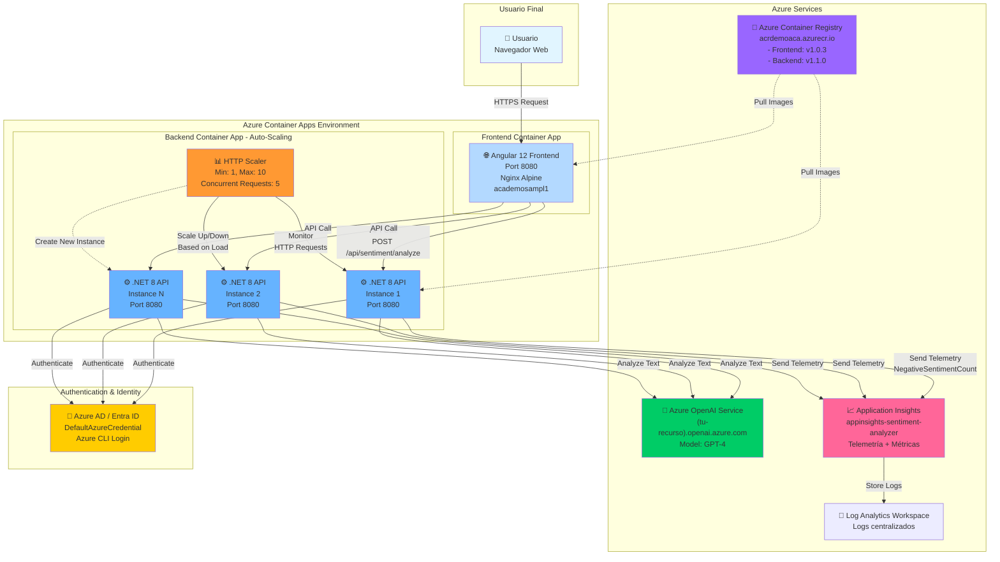
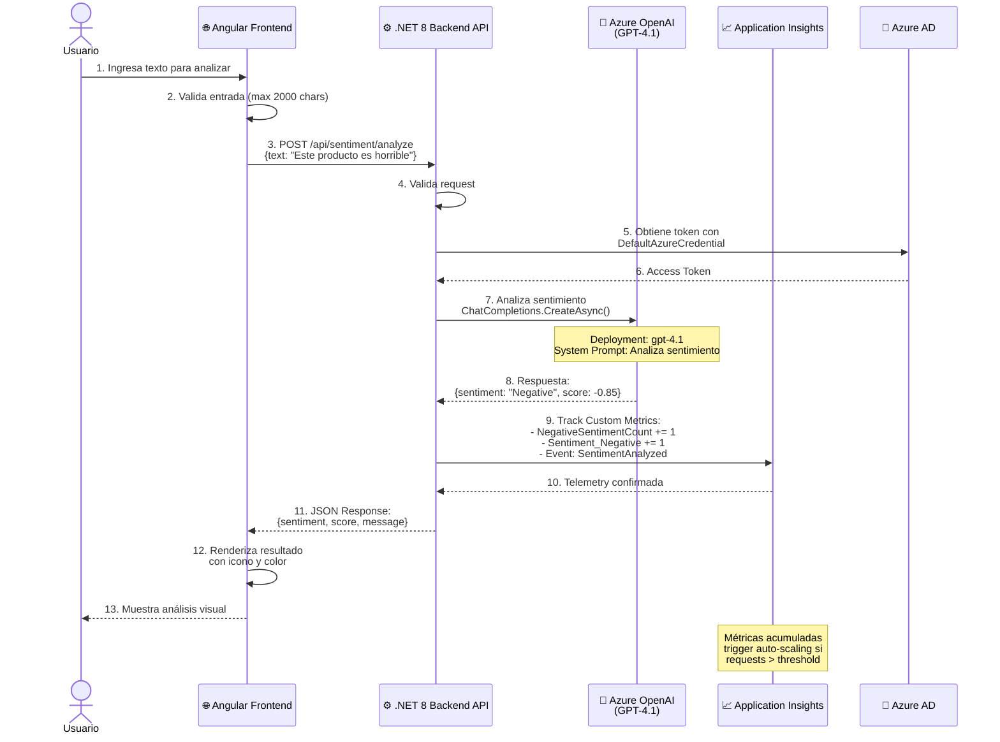
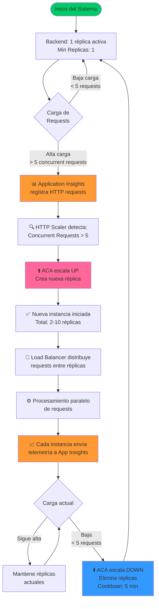
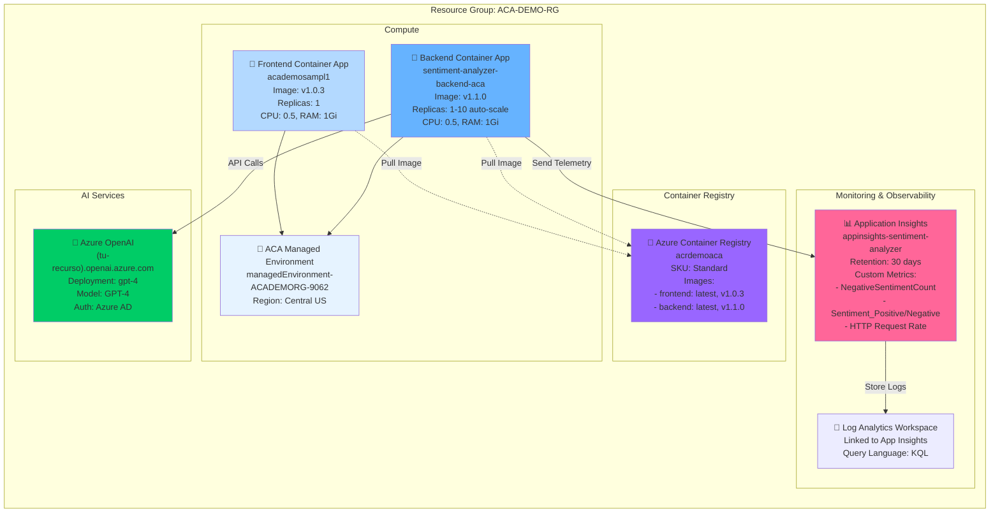
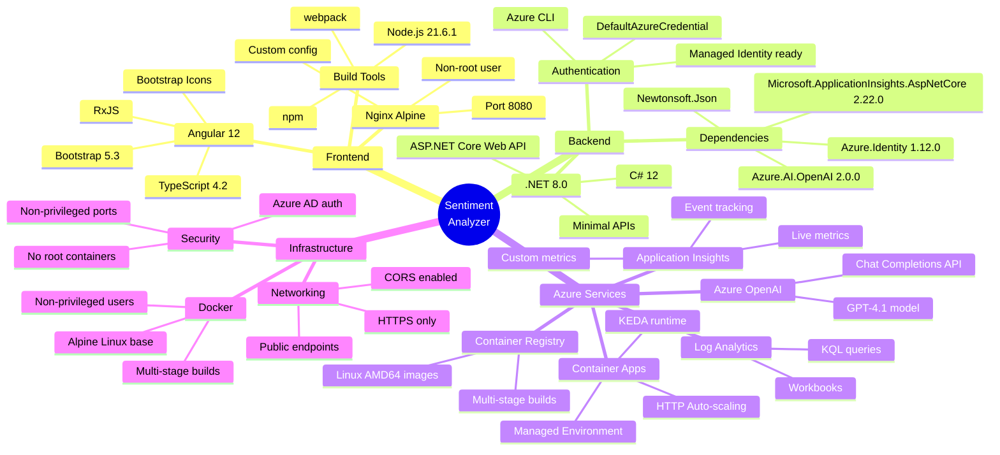
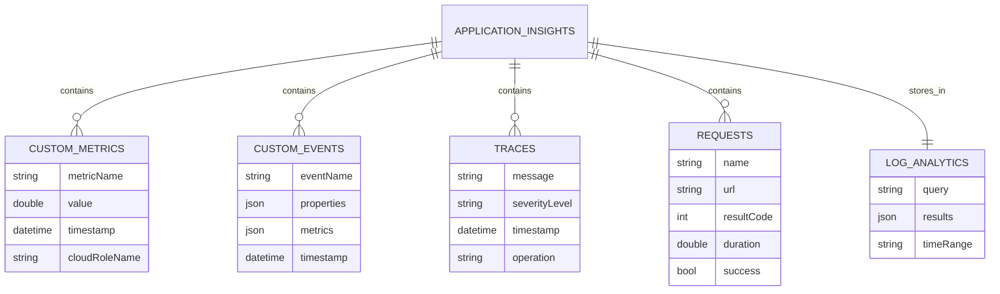
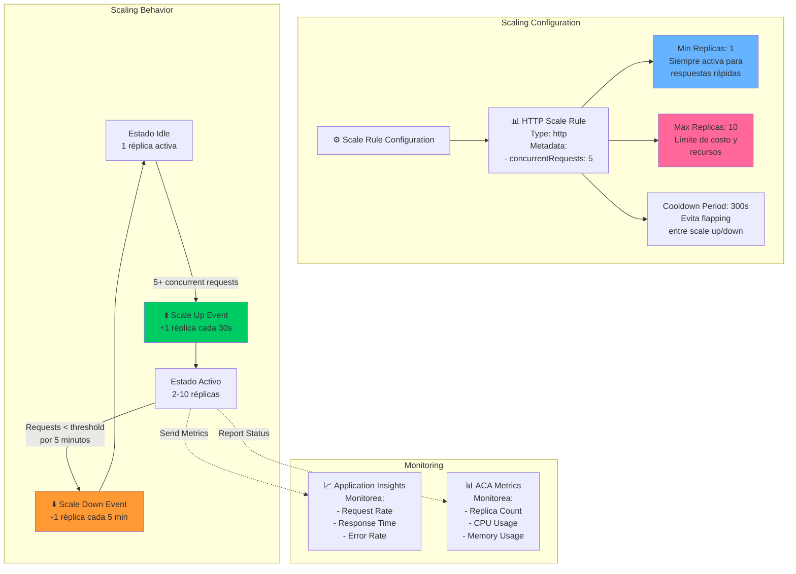
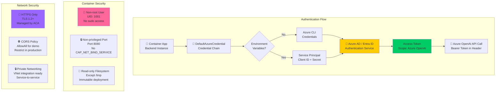
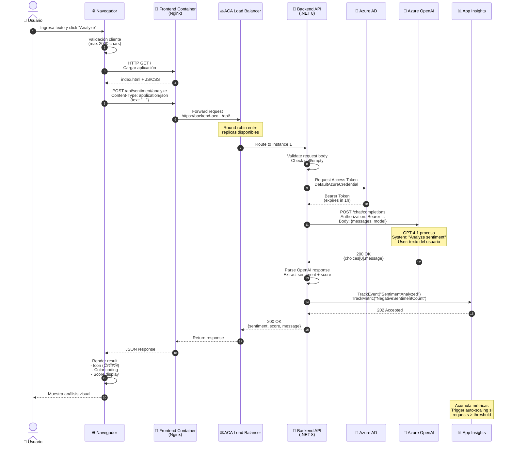

# 🏗️ Arquitectura del Sistema - Sentiment Analyzer

Este documento describe la arquitectura completa del sistema de análisis de sentimientos con escalado automático basado en telemetría de Application Insights.

---

## 📋 Índice

1. [Diagrama de Arquitectura General](#diagrama-de-arquitectura-general)
2. [Flujo de Análisis de Sentimientos](#flujo-de-análisis-de-sentimientos)
3. [Flujo de Escalado Automático](#flujo-de-escalado-automático)
4. [Componentes de Azure](#componentes-de-azure)
5. [Stack Tecnológico](#stack-tecnológico)
6. [Flujo de Despliegue CI/CD](#flujo-de-despliegue-cicd)

---

## 1️⃣ Diagrama de Arquitectura General

---

## 2️⃣ Flujo de Análisis de Sentimientos

---

## 3️⃣ Flujo de Escalado Automático

---

## 4️⃣ Componentes de Azure - Vista Detallada

---

## 5️⃣ Stack Tecnológico Completo

---

## 6️⃣ Flujo de Despliegue CI/CD (Propuesto)

```mermaid
graph TD
    DEV[👨‍💻 Developer] -->|git push| GITHUB[📦 GitHub Repository]
    
    GITHUB -->|Trigger| ACTIONS[⚡ GitHub Actions<br/>Workflow]
    
    ACTIONS --> BUILD_FRONT[🔨 Build Frontend<br/>Docker image]
    ACTIONS --> BUILD_BACK[🔨 Build Backend<br/>Docker image]
    
    BUILD_FRONT --> TEST_FRONT[🧪 Run Unit Tests<br/>npm test]
    BUILD_BACK --> TEST_BACK[🧪 Run Unit Tests<br/>dotnet test]
    
    TEST_FRONT -->|Pass| TAG_FRONT[🏷️ Tag Image<br/>v1.0.x]
    TEST_BACK -->|Pass| TAG_BACK[🏷️ Tag Image<br/>v1.1.x]
    
    TAG_FRONT --> PUSH_ACR_F[📤 Push to ACR<br/>frontend:latest]
    TAG_BACK --> PUSH_ACR_B[📤 Push to ACR<br/>backend:latest]
    
    PUSH_ACR_F --> DEPLOY_FRONT[🚀 Deploy to ACA<br/>Frontend]
    PUSH_ACR_B --> DEPLOY_BACK[🚀 Deploy to ACA<br/>Backend]
    
    DEPLOY_FRONT --> HEALTH_FRONT[💚 Health Check<br/>/health]
    DEPLOY_BACK --> HEALTH_BACK[💚 Health Check<br/>/health]
    
    HEALTH_FRONT -->|Healthy| COMPLETE
    HEALTH_BACK -->|Healthy| COMPLETE
    
    COMPLETE[✅ Deployment Complete<br/>Monitor in App Insights]
    
    COMPLETE --> MONITOR[👁️ Monitoring]
    
    MONITOR --> APPINSIGHTS_MON[📊 Application Insights<br/>- Performance<br/>- Errors<br/>- Custom Metrics]
    MONITOR --> ACA_MON[📈 ACA Metrics<br/>- Replicas<br/>- CPU/Memory<br/>- Requests]
    
    style GITHUB fill:#333
    style ACTIONS fill:#2088FF
    style COMPLETE fill:#00cc66
    style APPINSIGHTS_MON fill:#ff6699
```

---

## 7️⃣ Arquitectura de Datos - Telemetría

**Métricas Personalizadas Enviadas:**

1. **NegativeSentimentCount**: Contador de sentimientos negativos detectados
2. **Sentiment_Positive**: Contador de sentimientos positivos
3. **Sentiment_Negative**: Contador de sentimientos negativos
4. **Sentiment_Neutral**: Contador de sentimientos neutrales

**Eventos Personalizados:**

1. **SentimentAnalyzed**: 
   - Properties: Sentiment, Message
   - Metrics: Score

2. **NegativeSentimentDetected**:
   - Properties: Text, Severity
   - Metrics: NegativeScore

---

## 8️⃣ Configuración de Auto-Scaling

---

## 9️⃣ Seguridad y Autenticación

---

## 🔟 Request/Response Flow - Detallado

---

## 📊 Métricas y KPIs Monitoreados

| Métrica | Tipo | Threshold | Acción |
|---------|------|-----------|--------|
| **Concurrent HTTP Requests** | Performance | > 5 | Scale Up |
| **NegativeSentimentCount** | Custom | Acumulativo | Alertas |
| **Request Success Rate** | Availability | < 95% | Investigación |
| **Response Time (P95)** | Performance | > 2s | Optimización |
| **Replica Count** | Scaling | 1-10 | Costo/Performance balance |
| **CPU Usage** | Resource | > 80% | Considerar scale up |
| **Memory Usage** | Resource | > 85% | Considerar aumentar RAM |
| **OpenAI API Latency** | Dependency | > 3s | Revisar Azure OpenAI |
| **Error Rate 5xx** | Reliability | > 1% | Incident response |

---

## 🎯 Conclusiones Arquitectónicas

### ✅ Fortalezas del Diseño

1. **Escalabilidad Automática**: ACA escala de 1 a 10 réplicas basado en carga HTTP
2. **Observabilidad Completa**: Application Insights captura métricas personalizadas y telemetría
3. **Costo-Efectivo**: Escala a 1 réplica en idle, evitando costos innecesarios
4. **Seguridad**: Contenedores no-root, puertos no-privilegiados, Azure AD auth
5. **Desacoplamiento**: Frontend y Backend independientes, permite actualizaciones separadas
6. **Cloud-Native**: Aprovecha servicios managed de Azure (OpenAI, App Insights, ACA)

### 🔄 Mejoras Futuras Recomendadas

1. **Service Bus Queue**: Agregar cola para procesamiento asíncrono masivo
2. **Cosmos DB**: Almacenar histórico de análisis para analytics
3. **API Management**: Gateway API con rate limiting y caching
4. **Azure Front Door**: CDN global para el frontend
5. **Key Vault**: Gestión centralizada de secretos
6. **Managed Identity**: Migrar de Azure CLI a Managed Identity en producción
7. **VNet Integration**: Red privada para comunicación interna
8. **Dashboard**: Power BI o Grafana para visualización de métricas

---

## 📚 Referencias

- **Azure Container Apps**: https://docs.microsoft.com/azure/container-apps/
- **Application Insights**: https://docs.microsoft.com/azure/azure-monitor/app/app-insights-overview
- **Azure OpenAI**: https://docs.microsoft.com/azure/ai-services/openai/
- **KEDA Scalers**: https://keda.sh/docs/scalers/
- **Mermaid Diagrams**: https://mermaid.js.org/

---

**Última actualización**: 10 de Octubre, 2025  
**Versión del documento**: 1.0  
**Autor**: Sistema de Documentación Automatizada
