# 🔧 Configuración de KEDA con Log Analytics para Escalado Basado en Eventos

## 📋 Índice

1. [Introducción](#introducción)
2. [Arquitectura del Escalado](#arquitectura-del-escalado)
3. [Prerrequisitos](#prerrequisitos)
4. [Configuración con Managed Identity](#configuración-con-managed-identity)
5. [Configuración con Service Principal](#configuración-con-service-principal)
6. [Testing y Validación](#testing-y-validación)
7. [Troubleshooting](#troubleshooting)
8. [Queries KQL Útiles](#queries-kql-útiles)

---

## 🎯 Introducción

Este documento describe cómo configurar **KEDA (Kubernetes Event Driven Autoscaling)** en **Azure Container Apps** para escalar automáticamente basándose en eventos de sentimientos negativos detectados en **Log Analytics**.

### ¿Por qué KEDA con Log Analytics?

✅ **Event-Driven**: Escala basándose en eventos de negocio, no solo métricas técnicas  
✅ **Flexible**: Usa queries KQL personalizadas para cualquier criterio de escalado  
✅ **Costo-efectivo**: Escala solo cuando hay eventos relevantes  
✅ **Observable**: Toda la telemetría se mantiene en Application Insights  

### Flujo de Escalado

```
Usuario → Texto Negativo → Backend → OpenAI (análisis)
                                         ↓
                              Application Insights
                              (evento: SentimentAnalyzed)
                                         ↓
                              Log Analytics Workspace
                              (almacena eventos)
                                         ↓
                    KEDA Poll (cada 30s) → Query KQL
                    "¿Cuántos negativos en últimos 5 min?"
                                         ↓
                           ≥ 5 eventos → SCALE UP
                           < 5 eventos → SCALE DOWN
```

---

## 📐 Arquitectura del Escalado

```mermaid
graph TB
    subgraph "Backend Container Apps"
        B1[Réplica 1]
        B2[Réplica 2]
        BN[Réplica N]
    end
    
    subgraph "Telemetry Pipeline"
        AI[Application Insights]
        LA[Log Analytics]
    end
    
    subgraph "KEDA Scaler"
        KEDA[KEDA Controller]
        QUERY[KQL Query<br/>Negative count<br/>last 5 min]
    end
    
    B1 -->|Send Event| AI
    B2 -->|Send Event| AI
    BN -->|Send Event| AI
    
    AI -->|Store| LA
    
    KEDA -->|Poll every 30s| LA
    LA -->|Return count| QUERY
    
    QUERY -->|Count ≥ 5| SCALE_UP[Scale Up<br/>Add replica]
    QUERY -->|Count < 5| SCALE_DOWN[Scale Down<br/>Remove replica]
    
    SCALE_UP -.->|Create| BN
    SCALE_DOWN -.->|Terminate| BN
    
    style AI fill:#ff6699
    style LA fill:#ff9933
    style KEDA fill:#9966ff
    style SCALE_UP fill:#00cc66
    style SCALE_DOWN fill:#3399ff
```



---

## ✅ Prerrequisitos

Antes de configurar KEDA, asegúrate de tener:

1. **Azure Container App** desplegada y funcionando
2. **Application Insights** configurado y recibiendo telemetría
3. **Log Analytics Workspace** conectado a Application Insights
4. **Azure CLI** instalado y autenticado
5. **Managed Identity** habilitado en el Container App (recomendado)

### Verificar Prerrequisitos

```powershell
# 1. Verificar Container App
az containerapp show --name sentiment-analyzer-backend-aca --resource-group ACA-DEMO-RG

# 2. Verificar Application Insights
az monitor app-insights component show --app appinsights-sentiment-analyzer --resource-group ACA-DEMO-RG

# 3. Obtener Workspace ID
az monitor log-analytics workspace show --workspace-name <workspace-name> --resource-group ACA-DEMO-RG --query customerId -o tsv

# 4. Verificar eventos en Log Analytics
# Ir a Azure Portal → Log Analytics → Logs
# Ejecutar query:
app("appinsights-sentiment-analyzer").customEvents
| where name == "SentimentAnalyzed"
| take 10
```

---

## 🔐 Configuración con Managed Identity (Recomendado)

### Paso 1: Habilitar Managed Identity

```powershell
# Habilitar System-Assigned Managed Identity
az containerapp identity assign \
  --name sentiment-analyzer-backend-aca \
  --resource-group ACA-DEMO-RG \
  --system-assigned

# Obtener el Principal ID
$principalId = az containerapp identity show `
  --name sentiment-analyzer-backend-aca `
  --resource-group ACA-DEMO-RG `
  --query principalId -o tsv

Write-Host "Principal ID: $principalId"
```

### Paso 2: Asignar Roles Necesarios

```powershell
# 1. Rol para acceder a Log Analytics
az role assignment create \
  --assignee $principalId \
  --role "Log Analytics Reader" \
  --scope /subscriptions/<SUB_ID>/resourceGroups/ACA-DEMO-RG/providers/Microsoft.OperationalInsights/workspaces/<WORKSPACE_NAME>

# 2. Rol para acceder a Application Insights (si es necesario)
az role assignment create \
  --assignee $principalId \
  --role "Monitoring Reader" \
  --scope /subscriptions/<SUB_ID>/resourceGroups/ACA-DEMO-RG/providers/microsoft.insights/components/appinsights-sentiment-analyzer

# Verificar asignaciones
az role assignment list --assignee $principalId --output table
```

### Paso 3: Obtener IDs Necesarios

```powershell
# Tenant ID
$tenantId = az account show --query tenantId -o tsv
Write-Host "Tenant ID: $tenantId"

# Workspace ID
$workspaceId = az monitor log-analytics workspace show `
  --workspace-name <WORKSPACE_NAME> `
  --resource-group ACA-DEMO-RG `
  --query customerId -o tsv
Write-Host "Workspace ID: $workspaceId"
```

### Paso 4: Crear archivo YAML de configuración

Crea el archivo `aca-log-analytics-mi.yaml`:

```yaml
properties:
  template:
    scale:
      minReplicas: 1
      maxReplicas: 10
      rules:
        - name: negative-sentiment-keda-scale
          custom:
            type: azure-log-analytics
            metadata:
              tenantId: "TU_TENANT_ID_AQUI"
              workspaceId: "TU_WORKSPACE_ID_AQUI"
              query: |
                app("appinsights-sentiment-analyzer").customEvents
                | where name == "SentimentAnalyzed"
                | where customDimensions.Sentiment == "Negative"
                | where timestamp > ago(5m)
                | count
              threshold: "5"
              activationThreshold: "3"
            auth:
              - identity: system
```

### Paso 5: Aplicar Configuración

```powershell
# Reemplazar valores en el YAML (PowerShell)
(Get-Content aca-log-analytics-mi.yaml) `
  -replace 'TU_TENANT_ID_AQUI', $tenantId `
  -replace 'TU_WORKSPACE_ID_AQUI', $workspaceId `
  | Set-Content aca-log-analytics-mi-final.yaml

# Aplicar configuración
az containerapp update \
  --name sentiment-analyzer-backend-aca \
  --resource-group ACA-DEMO-RG \
  --yaml aca-log-analytics-mi-final.yaml
```

---

## 🔑 Configuración con Service Principal (CI/CD)

### Paso 1: Crear Service Principal

```powershell
# Crear SP con permisos en el Workspace
$sp = az ad sp create-for-rbac `
  --name "keda-sentiment-analyzer-sp" `
  --role "Log Analytics Reader" `
  --scopes /subscriptions/<SUB_ID>/resourceGroups/ACA-DEMO-RG/providers/Microsoft.OperationalInsights/workspaces/<WORKSPACE_NAME> `
  | ConvertFrom-Json

Write-Host "Client ID: $($sp.appId)"
Write-Host "Client Secret: $($sp.password)"
Write-Host "Tenant ID: $($sp.tenant)"

# ⚠️ Guardar estos valores de forma segura
```

### Paso 2: Crear Secretos en Container App

```powershell
az containerapp secret set \
  --name sentiment-analyzer-backend-aca \
  --resource-group ACA-DEMO-RG \
  --secrets \
    keda-tenant-id=$($sp.tenant) \
    keda-client-id=$($sp.appId) \
    keda-client-secret=$($sp.password)

# Verificar secretos (no muestra valores)
az containerapp secret list \
  --name sentiment-analyzer-backend-aca \
  --resource-group ACA-DEMO-RG \
  --output table
```

### Paso 3: Crear archivo YAML

Crea el archivo `aca-log-analytics-sp.yaml`:

```yaml
properties:
  template:
    scale:
      minReplicas: 1
      maxReplicas: 10
      rules:
        - name: negative-sentiment-keda-scale
          custom:
            type: azure-log-analytics
            metadata:
              tenantId: "TU_TENANT_ID_AQUI"
              workspaceId: "TU_WORKSPACE_ID_AQUI"
              query: |
                app("appinsights-sentiment-analyzer").customEvents
                | where name == "SentimentAnalyzed"
                | where customDimensions.Sentiment == "Negative"
                | where timestamp > ago(5m)
                | count
              threshold: "5"
              activationThreshold: "3"
            auth:
              - secretRef: keda-tenant-id
                triggerParameter: tenantId
              - secretRef: keda-client-id
                triggerParameter: clientId
              - secretRef: keda-client-secret
                triggerParameter: clientSecret
```

### Paso 4: Aplicar Configuración

```powershell
# Reemplazar valores
(Get-Content aca-log-analytics-sp.yaml) `
  -replace 'TU_TENANT_ID_AQUI', $($sp.tenant) `
  -replace 'TU_WORKSPACE_ID_AQUI', $workspaceId `
  | Set-Content aca-log-analytics-sp-final.yaml

# Aplicar
az containerapp update \
  --name sentiment-analyzer-backend-aca \
  --resource-group ACA-DEMO-RG \
  --yaml aca-log-analytics-sp-final.yaml
```

---

## 🧪 Testing y Validación

### 1. Verificar Configuración de Escalado

```powershell
# Ver configuración completa
az containerapp show \
  --name sentiment-analyzer-backend-aca \
  --resource-group ACA-DEMO-RG \
  --query "properties.template.scale" \
  -o json
```

**Output esperado**:
```json
{
  "maxReplicas": 10,
  "minReplicas": 1,
  "rules": [
    {
      "custom": {
        "auth": [
          {
            "identity": "system"
          }
        ],
        "metadata": {
          "activationThreshold": "3",
          "query": "app(\"appinsights-sentiment-analyzer\").customEvents...",
          "tenantId": "...",
          "threshold": "5",
          "workspaceId": "..."
        },
        "type": "azure-log-analytics"
      },
      "name": "negative-sentiment-keda-scale"
    }
  ]
}
```

### 2. Generar Eventos de Prueba

```powershell
# Enviar múltiples requests con sentimientos negativos
$backendUrl = "https://sentiment-analyzer-backend-aca.braveflower-b755a572.centralus.azurecontainerapps.io"

$negativeTexts = @(
    "This is terrible and I hate it",
    "Horrible experience, very disappointed",
    "Worst product ever, complete waste of money",
    "I'm extremely frustrated and angry",
    "Absolutely awful, do not recommend",
    "Very bad service, never again"
)

foreach ($text in $negativeTexts) {
    $body = @{ text = $text } | ConvertTo-Json
    
    Invoke-RestMethod `
        -Uri "$backendUrl/api/sentiment/analyze" `
        -Method Post `
        -ContentType "application/json" `
        -Body $body
    
    Write-Host "✅ Sent: $text" -ForegroundColor Yellow
    Start-Sleep -Seconds 2
}
```

### 3. Verificar Eventos en Log Analytics

```powershell
# Esperar 1-2 minutos para ingesta de datos
Start-Sleep -Seconds 120

# Ejecutar query en Log Analytics (Azure Portal)
```

**Query KQL**:
```kql
app("appinsights-sentiment-analyzer").customEvents
| where name == "SentimentAnalyzed"
| where customDimensions.Sentiment == "Negative"
| where timestamp > ago(10m)
| summarize Count = count() by bin(timestamp, 1m)
| render timechart
```

### 4. Monitorear Réplicas

```powershell
# Ver réplicas actuales (refrescar cada 30s)
while ($true) {
    Clear-Host
    Write-Host "=== Monitoring Replicas ===" -ForegroundColor Cyan
    Write-Host "Time: $(Get-Date -Format 'HH:mm:ss')" -ForegroundColor Gray
    
    az containerapp replica list \
      --name sentiment-analyzer-backend-aca \
      --resource-group ACA-DEMO-RG \
      --query "[].{Name:name, Status:properties.runningState, Created:properties.createdTime}" \
      --output table
    
    Write-Host "`nRefreshing in 30 seconds... (Ctrl+C to stop)" -ForegroundColor Gray
    Start-Sleep -Seconds 30
}
```

### 5. Validar Escalado

**Estado esperado**:

| Tiempo | Eventos Negativos (5 min) | Réplicas Esperadas | Estado |
|--------|---------------------------|-------------------|--------|
| T+0    | 0                         | 1                 | ✅ Idle |
| T+2min | 3                         | 1                 | ⚠️ Activation |
| T+4min | 6                         | 2                 | ✅ Scaled Up |
| T+6min | 8                         | 2-3               | ✅ Scaled Up |
| T+10min| 2 (window moved)          | 1                 | ✅ Scaled Down |

---

## 🔍 Troubleshooting

### Problema 1: No Escala Después de Generar Eventos

**Verificaciones**:

1. **¿Los eventos llegan a Application Insights?**
   ```kql
   customEvents
   | where name == "SentimentAnalyzed"
   | where timestamp > ago(10m)
   | count
   ```

2. **¿El query KQL devuelve el count correcto?**
   ```kql
   app("appinsights-sentiment-analyzer").customEvents
   | where name == "SentimentAnalyzed"
   | where customDimensions.Sentiment == "Negative"
   | where timestamp > ago(5m)
   | count
   ```

3. **¿Managed Identity tiene permisos?**
   ```powershell
   $principalId = az containerapp identity show --name sentiment-analyzer-backend-aca --resource-group ACA-DEMO-RG --query principalId -o tsv
   az role assignment list --assignee $principalId --output table
   ```
   Debe tener rol `Log Analytics Reader`.

4. **¿Hay latencia en ingesta de datos?**
   - Application Insights → Log Analytics puede tardar **1-5 minutos**
   - Espera al menos 5 minutos después de generar eventos

### Problema 2: Error de Autenticación en KEDA

**Síntomas**: Logs de ACA muestran errores de autenticación.

**Solución**:

```powershell
# Re-asignar rol
$principalId = az containerapp identity show --name sentiment-analyzer-backend-aca --resource-group ACA-DEMO-RG --query principalId -o tsv

az role assignment create \
  --assignee $principalId \
  --role "Log Analytics Reader" \
  --scope /subscriptions/<SUB_ID>/resourceGroups/ACA-DEMO-RG/providers/Microsoft.OperationalInsights/workspaces/<WORKSPACE_NAME>

# Reiniciar ACA
az containerapp revision restart \
  --name sentiment-analyzer-backend-aca \
  --resource-group ACA-DEMO-RG
```

### Problema 3: Query KQL No Devuelve Resultados

**Verificar sintaxis**:

```kql
// Query correcta
app("appinsights-sentiment-analyzer").customEvents
| where name == "SentimentAnalyzed"
| where customDimensions.Sentiment == "Negative"
| where timestamp > ago(5m)
| count

// Verificar que customDimensions.Sentiment existe
app("appinsights-sentiment-analyzer").customEvents
| where name == "SentimentAnalyzed"
| take 10
| project timestamp, customDimensions
```

**Notas**:
- El nombre del app debe coincidir exactamente: `"appinsights-sentiment-analyzer"`
- `customDimensions.Sentiment` es case-sensitive: `"Negative"` no `"negative"`

### Problema 4: Escalado Muy Lento

**Optimizaciones**:

1. **Reducir polling interval** (por defecto 30s):
   ```yaml
   metadata:
     pollingInterval: "15"  # 15 segundos
   ```

2. **Reducir cooldown period**:
   ```yaml
   scale:
     cooldownPeriod: 180  # 3 minutos en lugar de 5
   ```

3. **Ajustar ventana de tiempo**:
   ```yaml
   query: |
     ...
     | where timestamp > ago(3m)  # 3 min en lugar de 5
   ```

---

## 📊 Queries KQL Útiles

### Monitoring Dashboard Queries

**1. Total de eventos negativos en tiempo real**:
```kql
app("appinsights-sentiment-analyzer").customEvents
| where name == "SentimentAnalyzed"
| where customDimensions.Sentiment == "Negative"
| where timestamp > ago(5m)
| summarize Count = count()
| extend Status = iff(Count >= 5, "🔴 SCALING", iff(Count >= 3, "🟡 ACTIVATION", "🟢 NORMAL"))
```

**2. Distribución de sentimientos por minuto**:
```kql
app("appinsights-sentiment-analyzer").customEvents
| where name == "SentimentAnalyzed"
| where timestamp > ago(30m)
| extend Sentiment = tostring(customDimensions.Sentiment)
| summarize count() by Sentiment, bin(timestamp, 1m)
| render timechart
```

**3. Correlación entre eventos y réplicas** (manual):
```kql
let negatives = app("appinsights-sentiment-analyzer").customEvents
| where name == "SentimentAnalyzed"
| where customDimensions.Sentiment == "Negative"
| where timestamp > ago(1h)
| summarize NegativeCount = count() by bin(timestamp, 1m);
// Agregar manualmente data de réplicas desde az cli
negatives
| render timechart
```

**4. Rate de eventos por segundo**:
```kql
app("appinsights-sentiment-analyzer").customEvents
| where name == "SentimentAnalyzed"
| where timestamp > ago(10m)
| summarize EventsPerSecond = count() / 60.0 by bin(timestamp, 1m)
| render timechart
```

**5. Detectar cuando se debería escalar**:
```kql
app("appinsights-sentiment-analyzer").customEvents
| where name == "SentimentAnalyzed"
| where customDimensions.Sentiment == "Negative"
| where timestamp > ago(10m)
| summarize Count = count() by bin(timestamp, 5m)
| extend ShouldScale = iff(Count >= 5, "YES ⬆️", iff(Count >= 3, "MAYBE ⚠️", "NO ✅"))
| project timestamp, Count, ShouldScale
```

---

## 📚 Referencias

- **KEDA Azure Log Analytics Scaler**: https://keda.sh/docs/scalers/azure-log-analytics/
- **Azure Container Apps Scaling**: https://learn.microsoft.com/azure/container-apps/scale-app
- **Kusto Query Language (KQL)**: https://learn.microsoft.com/azure/data-explorer/kusto/query/
- **Application Insights**: https://learn.microsoft.com/azure/azure-monitor/app/app-insights-overview

---

## 🎯 Siguiente Pasos

1. ✅ Configurar alertas en Azure Monitor cuando count ≥ 10
2. ✅ Crear dashboard en Grafana/Power BI con métricas en tiempo real
3. ✅ Implementar múltiples scaling rules (HTTP + Log Analytics)
4. ✅ Optimizar query KQL para mejor performance
5. ✅ Agregar ML para predecir picos de sentimientos negativos

---

**Última actualización**: 14 de Octubre, 2025  
**Versión**: 1.0  
**Autor**: Equipo de Desarrollo Sentiment Analyzer
